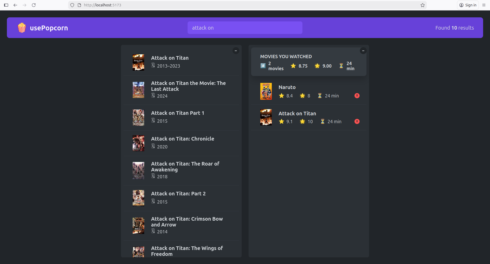

<h1 align="center">🍿 Use Popcorn </h1>

Use Popcorn is a project from the Udemy course **"The Ultimate React Course"**. It’s a movie search and rating app designed to practice **intermediate React concepts**, with a strong focus on component composition, hooks, and real-world state management patterns.

This repository is for educational purposes only. All learning materials and personal takeaways are stored in the `notes/` folder, which I continuously update while revisiting the course.

Keep up the good work 🔥🔥🔥

# Features

- 🔍 Search for your favorite movies
- ⭐ Rate movies easily
- 💾 Your rated movies are saved automatically using localStorage
- ⚡ Fast development setup with Vite and Bun

## Things I learned

- Component composition and prop drilling vs composition
- Thinking in React (splitting UI into reusable components)
- `useEffect`, `useRef`, and advanced state patterns
- Building and reusing custom hooks
- Persisting state with localStorage
- Fetching and managing external data

## Tech Stack

- 
- 
- 
- 

## Notes folder

- [Thinking in React](./notes/section-1/01-how-to-split-ui.md)
- How React works behind the scenes
- [Effects and Data fetching](./notes/section-3/)
- [Custom Hooks, refs, and more state](./notes/section-4/)

## screenshot form project



## 🚀 Getting Started

```bash
# Install dependencies
bun install


# Start development server
bun run dev
```

## Acknowledgments

- Jonas Schmedtmann – The Ultimate React Course
- Udemy platform

## 🙌 Thanks

Special thanks to:

- Jonas Schmedtmann for creating such a high-quality and well-structured React course
- Udemy for providing the learning platform
- The React community for excellent documentation and open-source resources

This project exists thanks to the knowledge shared by the community ❤️
